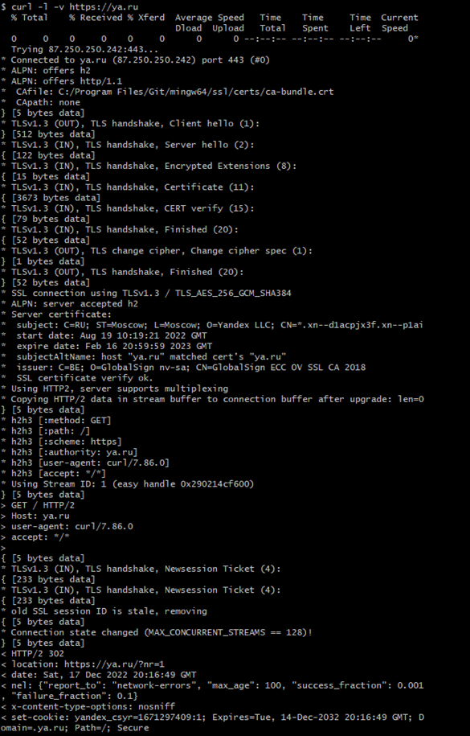

# Лабораторная работа №1
Цель работы
Познакомиться с протоколом HTTP и протоколом HTTPS, а также особенностями установления соединения между источником и получателем.
В итоге вы должны получить следующую информацию о ресурсе:
- IP адрес веб сервера
- порт к которому вы обращаетесь
-	истинное значение хоста ресурса
- информация о необходимости кэширования
- данные о формате данных которые содержатся в теле ответа
- код ответа и его значение
-	протокол по которому осуществлялся запрос
Для запроса используется команда crul -l -v “адресс”

1.	Запрос к https://ya.ru
•	IP "87.250.250.242"
•	порт "443"
•	истинное значение хоста ресурса "ya.ru"
•	информация о необходимости кэширования "no-cache,no-store,max-age=0,must-revalidate"
•	данные о формате данных которые содержатся в теле ответа "content-type-options: nosniff"
•	код ответа и его значение "200"
•	протокол по которому осуществлялся запрос "HTTP"

2.	Запрос к ya.ru
•	IP "87.250.250.242"
•	порт "80"
•	истинное значение хоста ресурса "ya.ru"
•	информация о необходимости кэширования " Cache-Control: max-age=1209600,private
•	данные о формате данных которые содержатся в теле ответа "content-type-options: nosniff"
•	код ответа и его значение "200"
•	протокол по которому осуществлялся запрос "HTTP"
 
3.	Запрос к https://git-scm.com
•	IP "188.114.98.224"
•	порт "443"
•	истинное значение хоста ресурса " git-scm.com "
•	информация о необходимости кэширования " cache-control: public, max-age=14400
•	данные о формате данных которые содержатся в теле ответа " x-content-type-options: nosniff "
•	код ответа и его значение "200"
•	протокол по которому осуществлялся запрос "HTTP"
	   

