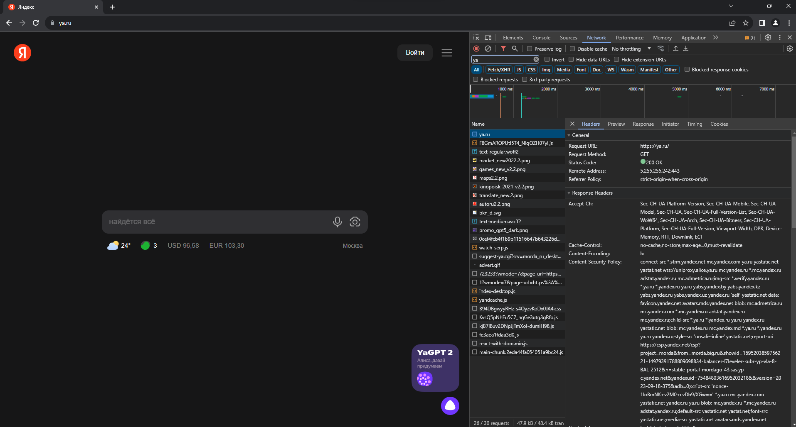
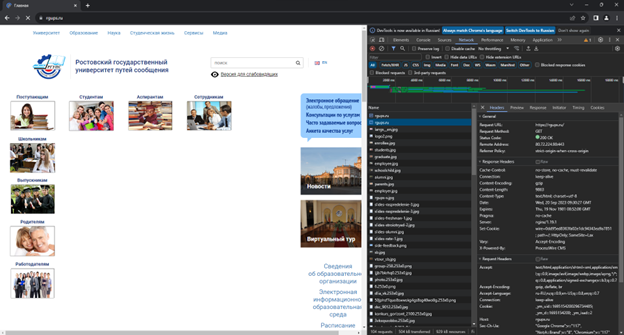
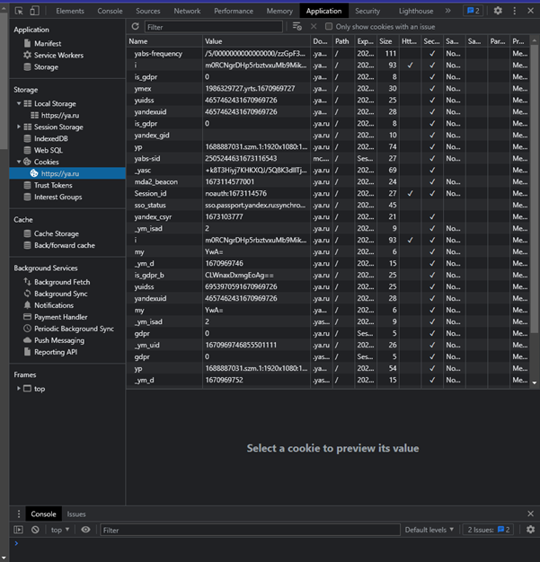
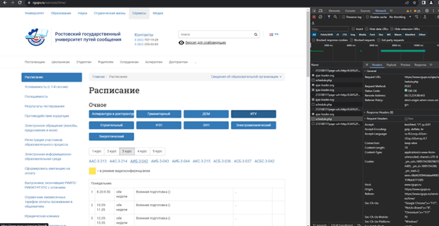
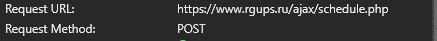

### Задание №1. Исследование заголовков и тела обычных запросов и их ответов.

В используемом браузере заблаговременно откройте инструменты разработчика, после чего перейдите по ссылке https://ya.ru/ и изучите во вкладке Network инструментов разработчика заголовки основного запроса и ответа на него:
- 	Request URL – https://ya.ru
- 	Request Method - Get
- 	Status Code - 200
- 	Remote Address – 87.250.250.242:443
- 	Referrer Policy – strict-origin-when-cross-origin
- 	content-type - text/html; charset=UTF-8
- 	cache-control – no-cache,no-store,max-age=0,must-revalidate
- 	cookie - yuidss=6953970591670969726; is_gdpr=0; is_gdpr_b=CLWnaxDxmgEoAg==; yandex_login=; yandexuid=4657462431670969726; yandex_gid=; font_loaded=YSv1; _ym_uid=1670969746855501111; _ym_d=1670969746; my=YwA=; yandex_csyr=1673103777; Session_id=noauth:1673114576; i=m0RCNgrDHp5rbztvxuMb9MikQvUYEqn/JTqGkIEYZgJfX5pjf35zbnAavJPaXi7iANNSPrOwG+l9iNQMJ2z+IydUY0w=; mda2_beacon=1673114577001; sso_status=sso.passport.yandex.ru:synchronized; yp=1687695992.szm.1:1920x1080:1140x961#1674606424.csc.1#1673116377.rnwcst.1; _yasc=ihM9x5bOBWOtMJd1nEbeF2Mfvs8CGRMg2isp+P+el7Q/25UNfq9QMzeM3lWT/ZhA
- 	user-agent - Mozilla/5.0 (Windows NT 10.0; Win64; x64) AppleWebKit/537.36 (KHTML, like Gecko) Chrome/108.0.0.0 Safari/537.36
- 	referer - нет
 

Ответьте на вопросы:

1.	Что означает каждый из этих заголовков?
   
Request URL - Запрашиваемый URI
Request Method – метод запроса
Status Code – статус выполнения запроса
Remote Address – ip адрес с портом
Referrer Policy - заголовок определяет, какие данные браузер может передать в HTTP-заголовке Referer
content-type - Заголовок-сущность Content-Type используется для того, чтобы определить MIME тип ресурса
cache-control - Сообщает, не является ли контент предназначенным для конкретного пользователя
cookie - это небольшой фрагмент данных, который сервер отправляет браузеру пользователя.
user-agent - это программный элемент браузера, обозначающий человека, пользующимся им.
Referrer - Содержит URL источника запроса

3.	Из каких частей состоит Remote Address?
   
Из ip-адреса и порта
5.	Что означает порт подключения? — опишите как вы это понимаете своими словами

Основным предназначением сетевых портов является прием и передача данных определенного вида, а также устранение ошибки неоднозначности при попытке установить связь с хостом по IP-адресу
6.	На какие секции разделены все заголовки? Какой смысл у каждой секции?

Разделены на заголовки ответов и запросов
7.	Какие заголовки повторяются в нескольких секциях? Какой в этом смысл?

Повторяются заголовки content-length, content-type. Запрос и ответ могут отличаться по типу и длине.

8.	Что из себя представляет тело ответа?
   
Когда мы получаем ответный запрос от сервера, тело сообщения, чаще всего представляет собой содержимое веб-страницы. Но, при запросах к серверу, оно тоже может иногда присутствовать, например, когда мы передаем данные, которые заполнили в форме обратной связи на сервер.

### Задание №2. Исследование указывающих ответов сервера.
При открытых во вкладке инструментах разработчика сделайте запрос на http://rgups.ru/ и обратите внимание на то изменился ли адрес в адресной строке? - Если Вы всё правильно сделали, то он должен был немного измениться.
 
 
Изучите из-за чего так произошло и ответьте на вопросы:
1.	Из-за чего произошло изменение адреса в адресной строке? Какие заголовки в этом поучаствовали и как?
   
Был осуществлен переход на протокол HTTPS
2.	Адрес был изменён в исходном запросе или потребовались дополнительные запросы, если были дополнительные запросы, то сколько?

Один запрос на изменения адреса
3.	Какой статус ответа имеет первоначальный запрос?

301 – для изначального запроса
200 – для перенаправленного

### Задание №3. Исследование получения и передачи cookie.
Повторите запрос на https://ya.ru/ и изучите заголовки влияющие на получение и отправку cookie параметров.
После чего:
1.	Перечислите название этих параметров и формат данных в них.

Path, domain, expires, secure
3.	Как можно удобно просмотреть все cookie, используемые на странице? Что означают их параметры Name, Value, Domain, Path и Expires?

Для получения Cookie необходим перейти в советующий раздел в dev tools
Name – имя файла, value – это значение, domain – список узлов с доступом к файлу, path – url-адрес, expires - дата

4.	Как просмотреть все cookie связанные с текущим (просматриваемым) сайтом?
   
Вкладка application, раздел cookie
 
5.	Опишите своими словами как вы понимаете суть и назначение cookie?

Некий ряд информации который не нужно постоянно обновлять, сохраняется в куки, тем самым повышая быстродействие сайта, не подгружая каждый раз одну и туже информацию

Задание №4. Исследование построения документов и сопутствующих запросов.
Изучите вкладку Elements и дерево тегов документа. Изучите список запросов на вкладке Network.

Ответьте на вопросы:
1.	Что такое DOM? — Опишите своими словами
   
DOM – это представление HTML-документа в виде дерева тегов.
3.	Может ли итоговый документ отличаться от тела ответа, полученного от сервера? Если да, то по каким причинам это может происходить?

Да, может. Пользователь может взаимодействовать с документом внося коррективы, простейший пример это темная тема на сайте.
4.	Почему если вы сделали всего один запрос, в списке огромное количество запросов и ответов? Что они из себя представляют и на каком основании браузер их делает?

Создав один запрос, мы активируем цепочку «сценарий» работы, которая в сою очередь выполняет все необходимые запросы для правильно функционирования сайта.
Задание №5. Определение параметров запроса.

Откройте главный сайт университета https://www.rgups.ru/services/time/. Используя инструменты разработчика вкладку Network определить запрос и параметры запроса позволяющие получить ваше расписание.
Список запросов и полученных файлов при вызове расписания
 
 
 
Ответьте на вопросы:
1.	Запрос к какому эндпоинту необходимо выполнить для получения вашего расписания
  
2.	Что содержится в теле ответа

Теле ответа содержится форма с расписанием занятий выбранной группы.
3.	Какого типа запрос вы выполнили?

Выполнили Post запрос
4.	Какие данные вы использовали для получения расписания

Для получения нам необходимо знать: название факультета, номер курса и название группы

